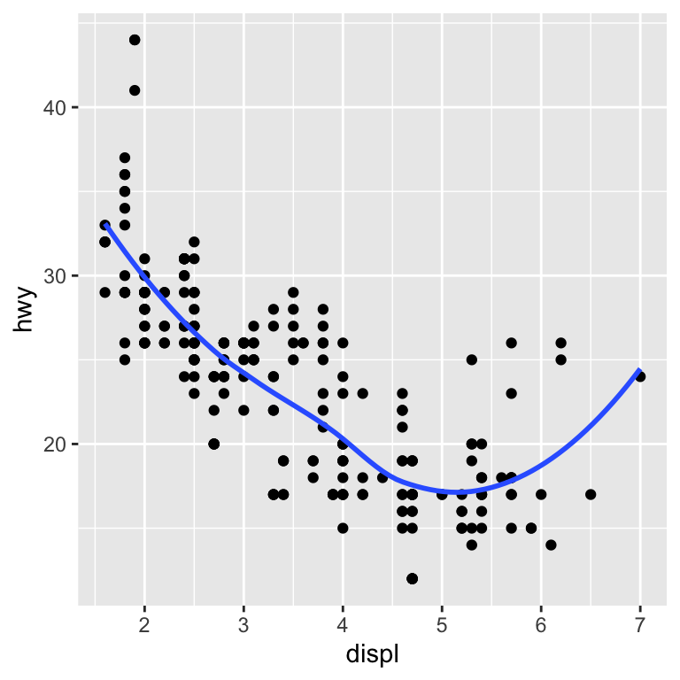
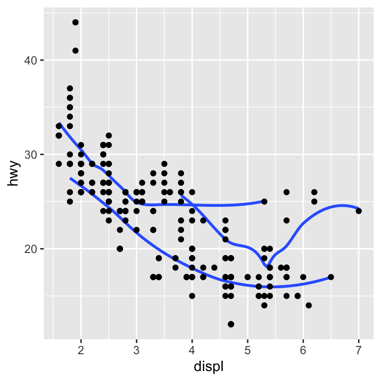
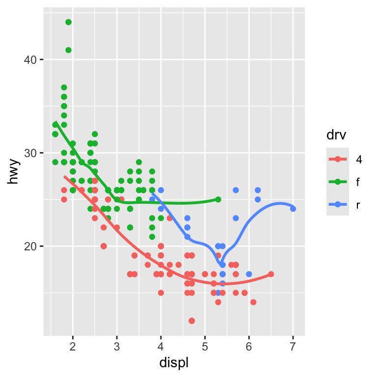
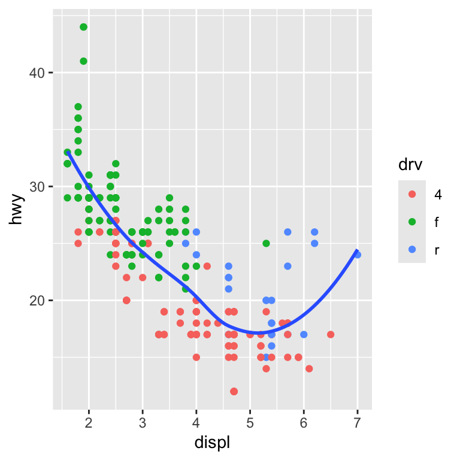
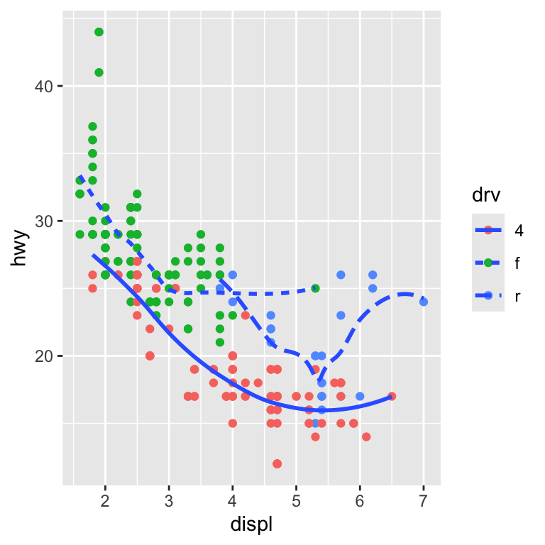
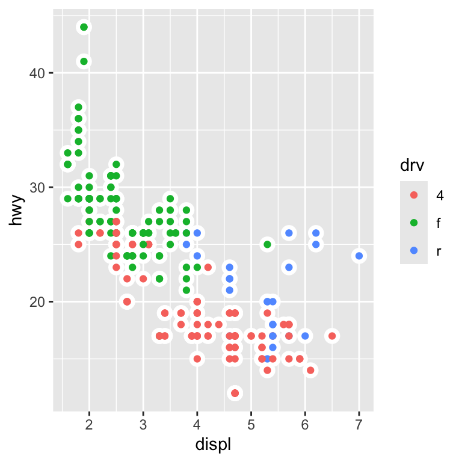
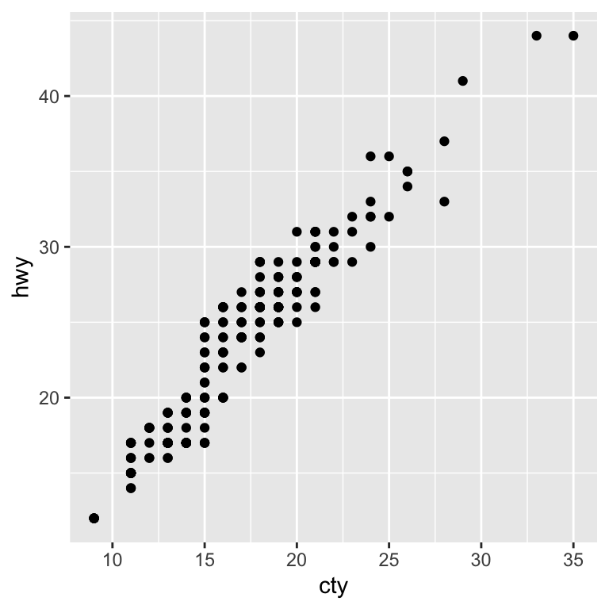

```{r setup, include = FALSE}
knitr::opts_chunk$set(
  echo = TRUE,          # the hand-in has to show the code
  message = FALSE,
  warning = FALSE,
  error = TRUE,
  comment = "#>",
  collapse = TRUE,
  fig.show = "hold",
  fig.align = "default",
  fig.width = 4,
  fig.height = 4,
  dpi = 150
)

options(dplyr.summarise.inform = FALSE)
set.seed(42)

library(tidyverse)
library(nycflights13)
```

> Source: Abe Hofman / R for Data Science; Wickham & Grolemund
> Work on these assignments individually. You can find the deadline in the course syllabus. After the deadline my own solutions will be posted on Canvas. This assignment won’t be graded, because a lot of materials are available online. But you do need to hand it in through Canvas. Use these online materials wisely!
> Make the assignment in a .R or Rmarkdown file. If you work in a .R file, use comments (for us or yourself) to keep thing readable and make sure you document runs without errors. If you use an Markdown file, Knit it to an HTML file and hand that in through Canvas. Make sure that it includes your code. We will give a short Markdown demo during one of the tutorials (see course syllabus).
> Read Ch 1, 2 and 18 before you start, and work on the exercises of Ch 19 the activate your Base-R knowledge.
> We assume that everything in Ch 4 and 6 is already known. Make sure to double check this. Ch 8 might be helpful if you have not worked in an R-project before. Not required, but might be very handy, feel free to ask questions about this during the tutorials.
> The assignment will cover Ch 3, 5 and 19, and includes a subset of the questions of these chapters.

## 3.2.4

**1. Run ggplot(data = mpg). What do you see?**

```{r ex-3-2-4-1}
ggplot(data = mpg)
```

We see a blank canvas, because we have not specified any variables to plot yet.

**2. How many rows are in mpg? How many columns?**

```{r ex-3-2-4-2}
cat("Number of rows:", nrow(mpg))
cat("Number of columns:", ncol(mpg))

glimpse(mpg)
```

**3. What does the drv variable describe? Read the help for ?mpg to find out.**

From the [docs](https://ggplot2.tidyverse.org/reference/mpg.html):

> **drv** - the type of drive train, where f = front-wheel drive, r = rear wheel drive, 4 = 4wd

```{r ex-3-2-4-3}
# ?mpg / ??mpg
count(mpg, drv)
```

**4. Make a scatterplot of hwy vs cyl.**

```{r ex-3-2-4-4}
ggplot(data = mpg) +
  geom_point(mapping = aes(x = cyl, y = hwy))
```

**5. What happens if you make a scatterplot of class vs drv? Why is the plot not useful?**

```{r ex-3-2-4-5}
ggplot(data = mpg) +
  geom_point(mapping = aes(x = class, y = drv))
```

Both data are categorical, and the points on the scatterplot overlap.

## 3.3.1

```{r ex-3-3-1-given}
ggplot(data = mpg) +
  geom_point(mapping = aes(x = displ, y = hwy, colour = "blue"))
```

**1. What’s gone wrong with this code? Why are the points not blue?**

Everything inside `aes()` is treated as a variable name,
so `color` evaluates to a new variable "blue", visuzlized with a default color.

Actually blue output:
```{r ex-3-3-1-1}
ggplot(data = mpg) +
  geom_point(mapping = aes(x = displ, y = hwy), colour = "blue")
```

**2. Map a continuous variable to color, size, and shape. How do these aesthetics behave differently for categorical vs. continuous variables?**

```{r ex-3-3-1-2, out.width="45%"}
# continuous to color
ggplot(mpg, aes(displ, hwy, colour = cty)) + geom_point()
# categorical to color
ggplot(mpg, aes(displ, hwy, colour = class)) + geom_point()

# continuous to size
ggplot(mpg, aes(displ, hwy, size = cty)) + geom_point()
# categorical to size
ggplot(mpg, aes(displ, hwy, size = class)) + geom_point()

# continuous to shape
ggplot(mpg, aes(displ, hwy, shape = cty)) + geom_point()
# categorical to shape
ggplot(mpg, aes(displ, hwy, shape = class)) + geom_point()
```

Mapping both continuous and categorical variables to color works well.
Mapping continuous variables to size works well, but while mapping categorical variables to size works, it doesn't make a lot of sense.
Mapping continuous to shape produces an error, and rightfully so because shapes are inherently discrete. Mapping categorical variables to shape works well.

**3. What happens if you map the same variable to multiple aesthetics?**

```{r ex-3-3-1-3}
ggplot(mpg, aes(displ, hwy, colour = class, size = class, shape = class)) + geom_point()
```

It works fine but it's unncessarily convoluted and confusing.

**4. What happens if you map an aesthetic to something other than a variable name, like aes(colour = displ < 5)? Note, you’ll also need to specify x and y.**

```{r ex-3-3-1-4}
ggplot(mpg, aes(displ, hwy, colour = displ < 5)) + geom_point()
```

The points are colored based on whether their `displ` value is less than 5 or not:
a result of a logical evaluation yielding TRUE or FALSE.

## 3.6.1: 6

{width=45%}
{width=45%}
{width=45%}
{width=45%}
{width=45%}
{width=45%}

**Recreate the R code necessary to generate the following graphs.**

```{r ex-3-6-1-6, out.width="45%"}
ggplot(mpg, aes(displ, hwy)) +
  geom_point() +
  geom_smooth(se = FALSE)

ggplot(mpg, aes(displ, hwy)) +
  geom_point() +
  geom_smooth(aes(group = drv), se = FALSE)

ggplot(mpg, aes(displ, hwy, color = drv)) +
  geom_point() +
  geom_smooth(se = FALSE)

ggplot(mpg, aes(displ, hwy)) +
  geom_point(aes(color = drv)) +
  geom_smooth(se = FALSE)

ggplot(mpg, aes(displ, hwy)) +
  geom_point(aes(color = drv)) +
  geom_smooth(aes(linetype = drv), se = FALSE)

ggplot(mpg, aes(displ, hwy)) +
  geom_point(color = "white", size = 4) +
  geom_point(aes(color = drv))
```


## 3.7.1: 2

**What does geom_col() do? How is it different to geom_bar()?**

From [docs](https://ggplot2.tidyverse.org/reference/geom_bar.html):

> `geom_bar()` makes the height of the bar proportional to the number of cases in each group
> (or if the weight aesthetic is supplied, the sum of the weights).
> If you want the heights of the bars to represent values in the data, use `geom_col()` instead.
> `geom_bar()` uses `stat_count()` by default: it counts the number of cases at each x position.
> `geom_col()` uses `stat_identity()`: it leaves the data as is.

```{r ex-3-7-1-2, out.width="45%"}
ggplot(mpg, aes(x = class)) + geom_bar()
ggplot(mpg, aes(x = class, y = hwy)) + geom_col()
```

## 3.8.1: 1

{width=45%}

**What is the problem with this plot? How could you improve it?**

The points overlap, which makes it difficult to see the density of points.
As a basic remedy, we could reduce the alpha of the points to make them more transparent.
Additionally, we could use `geom_jitter()` to reduce the overlap
or `geom_count()` to make the size of the points proportional to the number of overlapping points.

```{r ex-3-8-1-1, out.width="30%"}
ggplot(mpg, aes(x = cty, y = hwy)) + geom_point(alpha = 0.2)

ggplot(mpg, aes(x = cty, y = hwy)) + geom_jitter(alpha = 0.5, se = FALSE)

ggplot(mpg, aes(x = cty, y = hwy)) + geom_count(alpha = 0.5)
```

## 5.2.4: 1

**Find all flights that:**

```{r ex-5-2-4-1}
glimpse(flights)
```

**a. Had an arrival delay of two or more hours**

```{r ex-5-2-4-1a}
flights %>% filter(arr_delay >= 120)
```

**b. Flew to Houston (IAH or HOU)**

```{r ex-5-2-4-1b}
houston_airports <- c("IAH", "HOU")
flights %>% filter(dest %in% houston_airports)
```

**c. Were operated by United, American, or Delta**

```{r ex-5-2-4-1c}
carriers <- c("UA", "AA", "DL")
flights %>% filter(carrier %in% carriers)
```

**d. Departed in summer (July, August, and September)**

```{r ex-5-2-4-1d}
months <- c(7, 8, 9)
flights %>% filter(month %in% months)
```

**e. Arrived more than two hours late, but didn’t leave late**

```{r ex-5-2-4-1e}
flights %>% filter((dep_delay <= 0) & (arr_delay >= 120))
```

**f. Were delayed by at least an hour, but made up over 30 minutes in flight**

```{r ex-5-2-4-1f}
flights %>% filter((dep_delay >= 60) & (air_time > 30))
```

**g. Departed between midnight and 6 am (inclusive)**

```{r ex-5-2-4-1g}
flights %>% filter((dep_time >= 0) & (dep_time <= 600))
```

## 5.3.1

**1. How could you use arrange() to sort all missing values to the start? (Hint: use is.na()).**

```{r ex-5-3-1-1}
flights %>% arrange(desc(is.na(dep_delay)))
```

**2. Sort flights to find the most delayed flights. Find the flights that left earliest.**

```{r ex-5-3-1-2}
flights %>% arrange(desc(dep_delay)) # most delayed
flights %>% arrange(dep_delay) # left earliest (relative to scheduled time)
```

## 5.4.1

**1. Brainstorm as many ways as possible (at least two) to select dep_time, dep_delay, arr_time, and arr_delay from flights.**

```{r ex-5-4-1-1}
# using variable names directly
flights %>% select(dep_time, dep_delay, arr_time, arr_delay)
# using a character vector of variable names
flights %>% select(c("dep_time", "dep_delay", "arr_time", "arr_delay"))
# using all_of() with a character vector of variable names
flights %>% select(all_of(c("dep_time", "dep_delay", "arr_time", "arr_delay")))
# using starts_with() to select variables "dep_*" or "arr_*"
flights %>% select(starts_with("dep_"), starts_with("arr_"))
# using matches() with a regex to select "dep_*" or "arr_*"
flights %>% select(matches("^(dep|arr)_"))
# using column indices
flights %>% select(4, 6, 7, 9)
# base R
flights[, c("dep_time", "dep_delay", "arr_time", "arr_delay")]
# we can also subtract all other columns but I don't want to type them all out
# and there are other ways to do this, but I guess these are enough
```

**2. What happens if you include the name of a variable multiple times in a select() call?**

The variable is only selected once anyway, no erros are thrown.

```{r ex-5-4-1-2}
flights %>% select(dep_time, dep_time)
```

## 5.5.2: 1

**Currently dep_time and sched_dep_time are convenient to look at, but hard to compute with because they’re not really continuous numbers. Convert them to a more convenient representation of number of minutes since midnight.**

```{r ex-5-5-2-1}
to_minutes_since_midnight <- function(time) {
  (time %/% 100) * 60 + (time %% 100)
}

flights %>%
  mutate(
    dep_time_mins = to_minutes_since_midnight(dep_time),
    sched_dep_time_mins = to_minutes_since_midnight(sched_dep_time)
  ) %>%
  select(dep_time, dep_time_mins, sched_dep_time, sched_dep_time_mins)
```

## 5.6.7: 2

**Come up with another approach that will give you the same output as**

From [5.6](https://r4ds.had.co.nz/transform.html#grouped-summaries-with-summarise):

```{r ex-5-6-7-2}
not_cancelled <- flights %>%
  filter(!is.na(dep_delay), !is.na(arr_delay))
```

**a. not_cancelled %>% count(dest)**

```{r ex-5-6-7-2a}
# og
not_cancelled %>% count(dest)

# alternative
not_cancelled %>%
  group_by(dest) %>%
  summarise(n = n())
```

**b. not_cancelled %>% count(tailnum, wt = distance) (without using count()).**

```{r ex-5-6-7-2b}
# og
not_cancelled %>% count(tailnum, wt = distance)

# alternative
not_cancelled %>%
  group_by(tailnum) %>%
  summarise(n = sum(distance, na.rm = TRUE))
```

## 5.7.1: 4

**For each destination, compute the total minutes of arrival delay. For each flight, compute the proportion of the total delay for its destination.**

```{r ex-5-7-1-4}
not_cancelled %>%
  group_by(dest) %>%
  mutate(total_arr_delay = sum(arr_delay, na.rm = TRUE)) %>%
  ungroup() %>%
  mutate(prop_total_delay = arr_delay / total_arr_delay) %>%
  select(dest, arr_delay, total_arr_delay, prop_total_delay)
```

## 19.2.1: 5

**Write both_na(), a function that takes two vectors of the same length and returns the number of positions that have an NA in both vectors**

```{r ex-19-2-1-5}
both_na <- function(x, y) {
  stopifnot(
    "x and y must be the same length" = length(x) == length(y)
  )
  sum(is.na(x) & is.na(y))
}

test_x <- c(1, NA, 3, NA, 5)
test_y <- c(NA, NA, 3, 4, NA)
both_na(test_x, test_y)
```

## 19.4.4

**1. What’s the difference between if and ifelse()? Carefully read the help and construct three examples that illustrate the key differences.**

```{r ex-19-4-4-1}
date_threshold <- as.Date("2026-09-06")

# if with a single value, class preserved
test_date <- as.Date("2026-09-05")
if (test_date < date_threshold) {
  cat(format(test_date), "is before threshold")
} else {
  cat(format(test_date), "is not before threshold")
}

# if with NA throws an error (doesn't resolve it)
if (NA < date_threshold) {
  cat("NA is before threshold")
} else {
  cat("NA is not before threshold")
}

# ifelse with a vector, NA preserved, but the class is stripped
test_dates <- as.Date(c("2026-09-05", "2026-09-07", NA))
result <- ifelse(test_dates < date_threshold, "before threshold", "after threshold")

cat("class of test_dates:", class(test_dates), "\n")
cat("class of result:", class(result), "\n\n")
print(result)

```

**2. Write a greeting function that says “good morning”, “good afternoon”, or “good evening”, depending on the time of day. (Hint: use a time argument that defaults to lubridate::now(). That will make it easier to test your function.)**

```{r ex-19-4-4-2}
greeting <- function(time = lubridate::now()) {
  hour <- lubridate::hour(time)
  if (hour < 12) {
    "Good morning"
  } else if (hour < 18) {
    "Good afternoon"
  } else {
    "Good evening"
  }
}

greeting()
```

## 19.5.5: 1

From [19.5](https://r4ds.had.co.nz/functions.html#dot-dot-dot):

```{r ex-19-5-5-1}
commas <- function(...) stringr::str_c(..., collapse = ", ")

commas(letters[1:10])
```

**What does commas(letters, collapse = “-”) do? Why?**

```{r ex-19-5-5-1a}
commas(letters, collapse = "-")
```

It throws an error because `commas()` already fixes the `collapse` when passing to `str_c()`,
so the "new" `collapse` argument is not passed to `str_c()` and instead treated as a new argument to `commas()`,
which doesn't know what to do with it.
