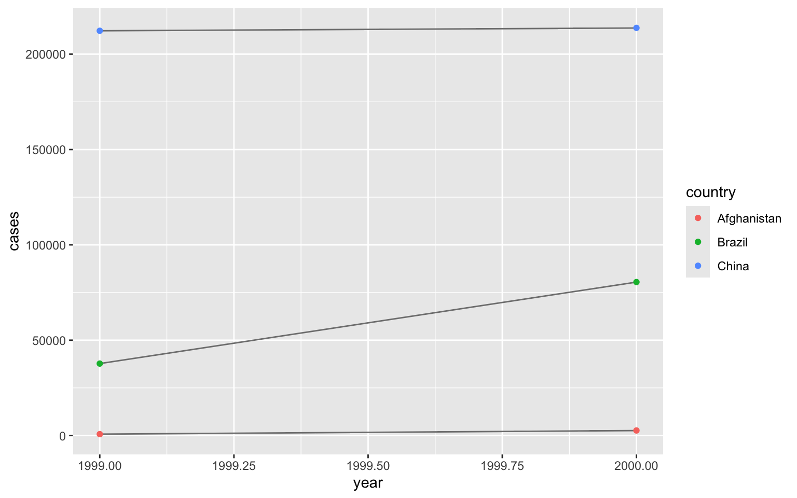

```{r setup, include = FALSE}
knitr::opts_chunk$set(
  echo = TRUE, # the hand-in has to show the code
  message = FALSE,
  warning = TRUE,
  error = TRUE,
  comment = "#>",
  collapse = TRUE,
  fig.show = "hold",
  fig.align = "default",
  fig.width = 7,
  fig.height = 4,
  dpi = 150
)

options(dplyr.summarise.inform = FALSE)
set.seed(42)

library(tidyverse)
library(nycflights13)
```

> Source: Abe Hofman / R for Data Science; Wickham & Grolemund
> Work on these assignments individually. You can find the deadline in the course syllabus. After the deadline my own solutions will be posted on Canvas. This assignment won’t be graded, because a lot of materials are available online. But you do need to hand it in through Canvas. Use these online materials wisely!
> Make the assignment in a .R or Rmarkdown file. If you work in a .R file, use comments (for us or yourself) to keep thing readable and make sure you document runs without errors. If you use an Markdown file, Knit it to an HTML file and hand that in through Canvas. Make sure that it includes your code. We will give a short Markdown demo during one of the tutorials (see course syllabus).
> The assignment will cover Ch 9-13, 15, 16 and includes a subset of the questions of these chapters [you can skip 14].

## 10.5

**1. How can you tell if an object is a tibble? (Hint: try printing mtcars, which is a regular data frame).**

```{r ex-10-5-1, out.width="50%"}
mtcars # the rows are named
mtcars_tibble <- as_tibble(mtcars)
mtcars_tibble
```

```{r ex-10-5-1a}
class(mtcars)
class(mtcars_tibble)
```

**2. Compare and contrast the following operations on a data.frame and equivalent tibble. What is different? Why might the default data frame behaviours cause you frustration?**

From [10.5](https://r4ds.had.co.nz/tibbles.html):

```{r ex-10-5-2-given}
df <- data.frame(abc = 1, xyz = "a")
df$x
df[, "xyz"]
df[, c("abc", "xyz")]
```

```{r ex-10-5-2}
# tibble equivalent
tb <- tibble(abc = 1, xyz = "a")
tb$x
tb[, "xyz"]
tb[, c("abc", "xyz")]
```

The data frame returns a vector when selecting a single column, and
a data frame when selecting multiple columns. So, the output type is inconsistent.
In contrast, tibble returns a tibble either way.

Also, the data frame accepts partial matching of column names.
This can lead to weird results if, for example, there're typos in column names.
In contrast, tibble throws a warning and returns `NULL` if a column name is not exactly matched.


## 11.2.2


**1. What function would you use to read a file where fields were separated with “|”?**

```{r ex-11-2-2-1}
read_delim(I("a|b|c\n1|2|3"), delim = "|")
```

**2. What are the most important arguments to read_fwf()?**

From [docs](https://readr.tidyverse.org/reference/read_fwf.html), it's `col_positions`
(besides the file of course).
It's used to specify the column positions since fixed width files don't have a delimiter.

```{r ex-11-2-2-2}
test_fwf <- I("AAAAAA\nBBBBBB")
read_fwf(test_fwf, fwf_widths(c(1, 2, 3)))
read_fwf(test_fwf)
```

**3. Identify what is wrong with each of the following inline CSV files. What happens when you run the code?**

```{r ex-11-2-2-3-given}
read_csv("a,b\n1,2,3\n4,5,6")
read_csv("a,b,c\n1,2\n1,2,3,4")
read_csv("a,b\n\"1")
read_csv("a,b\n1,2\na,b")
read_csv("a;b\n1;3")
# e.g. this works:
read_csv("a,b,c\n1,2,3\n4,5,6")
```

a. Uneven number of cols on line 1 vs others. Causes the last 2 cols to be squashed in the last col.
b. Uneven number of cols on all lines. Causes the values in the last col to be squashed when present, and NA if not.
c. Unclosed quote. The parser inserts a newline char at the end of literal strings. So, this causes the parser to read the next line as part of the character value, including `\n`.
d. I don't see a problem besides line duplication. But it could be an issue that the column types are char?
e. Wrong delimiter. Causes the parser to read the whole line as a single value.
f. Indeed works well.


## 11.3.5.7

```{r ex-11-3-5-7-given}
d1 <- "January 1, 2010"
d2 <- "2015-Mar-07"
d3 <- "06-Jun-2017"
d4 <- c("August 19 (2015)", "July 1 (2015)")
d5 <- "12/30/14" # Dec 30, 2014
t1 <- "1705"
t2 <- "11:15:10.12 PM"
```

**Generate the correct format string to parse each of the following dates and times:**

```{r ex-11-3-5-7}
parse_date(d1, "%B %d, %Y")
parse_date(d2, "%Y-%b-%d")
parse_date(d3, "%d-%b-%Y")
parse_date(d4, "%B %d (%Y)")
parse_date(d5, "%m/%d/%y")
parse_time(t1, "%H%M")
parse_time(t2, "%I:%M:%OS %p")
```

## 12.2.1: 3

{width=50%}

**Recreate the plot showing change in cases over time using table2 instead of table1. What do you need to do first?**

```{r ex-12-2-1-3, out.width="45%"}
glimpse(table1)
glimpse(table2)

table2_cases <- table2 %>%
  filter(type == "cases") %>%
  rename(cases = count) %>%
  select(-type)

glimpse(table2_cases)

# og
ggplot(table1, aes(year, cases)) +
  geom_line(aes(group = country), colour = "grey50") +
  geom_point(aes(colour = country))

# same code with table2
ggplot(table2_cases, aes(year, cases)) +
  geom_line(aes(group = country), colour = "grey50") +
  geom_point(aes(colour = country))
```

## 12.3.3: 3

**What would happen if you widen this table? Why? How could you add a new column to uniquely identify each value?**

From [12.3](https://r4ds.had.co.nz/tidy-data.html):

```{r ex-12-3-3-3}
people <- tribble(
  ~name, ~names, ~values,
  #-----------------|--------|------
  "Phillip Woods", "age", 45,
  "Phillip Woods", "height", 186,
  "Phillip Woods", "age", 50,
  "Jessica Cordero", "age", 37,
  "Jessica Cordero", "height", 156
)
```

```{r ex-12-3-3-3a}
people %>%
  pivot_wider(names_from = names, values_from = values)
```

It gives a warning because there are multiple values for `age` in `Phillip Woods`,
and there are no identifiers to distinguish between them.

```{r ex-12-3-3-3b}
people %>%
  group_by(name, names) %>%
  mutate(id = row_number()) %>%
  ungroup() %>%
  pivot_wider(names_from = names, values_from = values)
```

We added an `id` column to identify different values for
the same `name` and `names` combination.
However, this is still ambiguous because if those are 2 different people with the same name,
we don't know which person the `heightz entry correspond to.

## 12.4.3: 1

**What do the extra and fill arguments do in separate()? Experiment with the various options for the following two toy datasets.**

```{r ex-12-4-3-1-given}
tibble(x = c("a,b,c", "d,e,f,g", "h,i,j")) %>%
  separate(x, c("one", "two", "three"))
```

```{r ex-12-4-3-1-given-2}
tibble(x = c("a,b,c", "d,e", "f,g,i")) %>%
  separate(x, c("one", "two", "three"))
```

From [docs](https://tidyr.tidyverse.org/reference/separate.html), the (not combined) options are:

```{r ex-12-4-3-1}
test_d <- tibble(x = c("a,b,c", "d,e,f,g", "h,i,j"))

# extra
test_d %>% separate(x, c("one", "two", "three"), extra = "warn")
test_d %>% separate(x, c("one", "two", "three"), extra = "drop")
test_d %>% separate(x, c("one", "two", "three"), extra = "merge")
# fill
test_d %>% separate(x, c("one", "two", "three"), fill = "warn")
test_d %>% separate(x, c("one", "two", "three"), fill = "right")
test_d %>% separate(x, c("one", "two", "three"), fill = "left")
```

## 13.4.6: 2

**Add the location of the origin and destination (i.e. the lat and lon) to flights.**

```{r ex-13-4-6-2}
airports_locations <- airports %>% select(faa, lat, lon)

flights %>%
  left_join(airports_locations, by = c("origin" = "faa")) %>%
  rename(origin_lat = lat, origin_lon = lon) %>%
  left_join(airports_locations, by = c("dest" = "faa")) %>%
  rename(dest_lat = lat, dest_lon = lon)
```

## 13.5.1: 2

**Filter flights to only show flights with planes that have flown at least 100 flights.**

```{r ex-13-5-1-2}
flights %>%
  filter(!is.na(tailnum)) %>%
  group_by(tailnum) %>%
  filter(n() >= 100) %>%
  ungroup()

# what i think you want here but unnecessary because we're using the sama table
planes_100flights <- flights %>%
  filter(!is.na(tailnum)) %>%
  count(tailnum) %>%
  filter(n >= 100)

flights %>%
  semi_join(planes_100flights, by = "tailnum")
```

## 15.3.1

**The following questions are about the forcats::gss_cat dataset**

```{r ex-15-3-1}
glimpse(gss_cat)
```

**2. Explore the distribution of rincome (reported income). What makes the default bar chart hard to understand? How could you improve the plot?**

```{r ex-15-3-1-1, out.width="50%"}
ggplot(gss_cat, aes(rincome)) +
  geom_bar()

ggplot(gss_cat, aes(rincome)) +
  geom_bar() +
  coord_flip()
```

The x labels are overlapping, so we can flip the coordinates, for example.

**3. What is the most common relig in this survey? What’s the most common partyid?**

```{r ex-15-3-1-2}
most_common_relig <- gss_cat %>%
  count(relig) %>%
  arrange(desc(n)) %>%
  slice(1)

cat(
  "Most common relig:", as.character(most_common_relig$relig),
  "with", most_common_relig$n, "occurrences."
)

most_common_partyid <- gss_cat %>%
  count(partyid) %>%
  arrange(desc(n)) %>%
  slice(1)

cat(
  "Most common partyid:", as.character(most_common_partyid$partyid),
  "with", most_common_partyid$n, "occurrences."
)
```

## 15.5.1: 1

**How have the proportions of people identifying as Democrat, Republican, and Independent changed over time?**

```{r ex-15-5-1-1}
glimpse(gss_cat)

get_partyid_options <- function(x, excl = NA) {
  x_lower <- tolower(x)
  options <- gss_cat %>%
    select(partyid) %>%
    filter(!is.na(partyid)) %>%
    mutate(partyid_lower = tolower(partyid)) %>%
    filter(str_detect(partyid_lower, x_lower))

  if (!is.na(excl)) {
    excl_lower <- tolower(excl)
    options <- options %>%
      filter(!str_detect(partyid_lower, excl_lower))
  }

  options %>%
    distinct() %>%
    pull(partyid)
}

democrat_options <- get_partyid_options("dem", excl = "ind")
democrat_options

republican_options <- get_partyid_options("rep", excl = "ind")
republican_options

independent_options <- get_partyid_options("ind")
independent_options

gss_cat_props <- gss_cat %>%
  mutate(partyid = fct_collapse(
    partyid,
    "Democrat" = democrat_options,
    "Republican" = republican_options,
    "Independent" = independent_options
  )) %>%
  filter(partyid %in% c("Democrat", "Republican", "Independent")) %>%
  count(year, partyid) %>%
  group_by(year) %>%
  mutate(prop = n / sum(n)) %>%
  ungroup()

glimpse(gss_cat_props)

ggplot(gss_cat_props, aes(year, prop, colour = partyid)) +
  geom_line() +
  geom_point()
```

## 16.2.4: 3

```{r ex-16-2-4-3-given}
d1 <- "January 1, 2010"
d2 <- "2015-Mar-07"
d3 <- "06-Jun-2017"
d4 <- c("August 19 (2015)", "July 1 (2015)")
d5 <- "12/30/14" # Dec 30, 2014
```

**Use the appropriate lubridate function to parse each of the following dates:**

```{r ex-16-2-4-3}
mdy(d1)
ymd(d2)
dmy(d3)
mdy(d4)
mdy(d5)
```

## 16.3.4: 5

**About the flights dataset. On what day of the week should you leave if you want to minimise the chance of a delay?**

```{r ex-16-3-4-5}
least_delay <- flights %>%
  filter(!is.na(time_hour)) %>%
  mutate(week_day = wday(time_hour, label = TRUE)) %>%
  group_by(week_day) %>%
  summarise(
    prop_arr_delay = mean(arr_delay > 0, na.rm = TRUE)
  ) %>%
  arrange(prop_arr_delay) %>%
  slice(1)

cat(
  "The least delays occur on", as.character(least_delay$week_day),
  "with a proportion of", least_delay$prop_arr_delay, "of flights delayed."
)
```

## 16.4.5: 4

**Write a function that given your birthday (as a date), returns how old you are in years.**

```{r ex-16-4-5-4}
age <- function(x) {
  (x %--% today()) %/% years(1)
}

birthday <- today() %>% update(year = 1995)

cat(
  "If you were born on", as.character(birthday),
  "you are", age(birthday), "years old."
)
```

